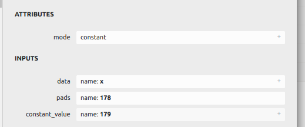
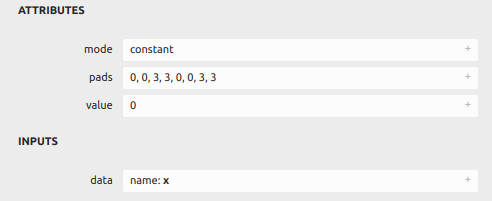

pytorch模型转tensorrt，pad报错，解决方案


#### 背景

工程化模型部署时，对pytorch模型使用tensorrt进行推理加速，需要将pytorch转为onnx进而转化为tensorrt进行部署。

但是当pytorch的基本模型中使用了F.Pad/zeropadding/constpadding等pad操作时，使用torch.onnx.export转出onnx模型参数选opset 11，后续转tensorrt时会报错，报错信息根据onnx-tensorrt的版本不同会有变化，但都不能正常完成转化。


##### 软件环境

OS：ubuntu16.04

cuda：9.0

tensorrt：7.0

onnx-tensorrt：branch7.0

python：3.6

torch：1.6.0

报错信息：

*[In function importPad: [8\] Assertion failed: inputs.at(1).is_weights()]*


如使用onnx-tensorrt：branch8.4

报错信息：

*[10/10/2022-17:50:38] [E] [TRT] ModelImporter.cpp:776: --- End node ---*
*[10/10/2022-17:50:38] [E] [TRT] ModelImporter.cpp:778: ERROR: ModelImporter.cpp:180 In function parseGraph:*
*[6] Invalid Node - Pad_14*
*[shuffleNode.cpp::symbolicExecute::392] Error Code 4: Internal Error (Reshape_3: IShuffleLayer applied to shape tensor must have 0 or 1 reshape dimensions: dimensions were [-1,2])*
*[10/10/2022-17:50:38] [E] Failed to parse onnx file*


#### 问题定位

通过编译onnx-tensorrt工程，直接使用onnxtrt程序进行模型转化调试，发现当pytorch转onnx采用opset11时，pad层的信息为：



也即是，pad层有三个输入，pad相关参数也作为输入传入。

程序执行DEFINE_BUILTIN_OP_IMPORTER(Pad))函数时，通过解析inputs获取padding信息，但是在解析input2时报错：


```cpp
ASSERT(inputs.at(1).is_weights(), ErrorCode::kUNSUPPORTED_NODE);
weightsToVector(inputs.at(1).weights(), &onnxPadding);
```


这是因为input2数据类型为Tensor而非weight，就算注释该信息，仍然无法从tensor中获取pad操作需要的边界信息，最终无法实现该功能。


而非opset9的：





此时，pad层仅有一个输入，pad相关参数作为attributes传入。

程序执行DEFINE_BUILTIN_OP_IMPORTER(Pad)函数时，通过读取属性参数获取padding信息。

```cpp
if (ctx->getOpsetVersion() < 11)
    {
        value = attrs.get<float>("value", 0.f);
        auto padding = attrs.get<std::vector<int>>("pads");
        onnxPadding = std::vector<int64_t>(padding.begin(), padding.end());
    }
```


#### 解决思路

pytorch转onnx时opset11对pad的处理导致最终无法实现pad层的转化工作，所以解决方案有两个方向;

1.在pytorch中不使用pad或者转onnx时使用opset9；

2.对onnx-tensorrt源码进行修改，完成对pad三个input中后两个输入的解析工作


#### 解决方案

pytorch测规避pad或使用opset9代替opset11

##### 1.在pytorch中不使用pad

使用conv时附带padding的方法替换padding操作，

优点：操作简洁，不存在源码的修改

缺点：会对模型结构微调、conv并不能完全替换pad（如果constpadding为非零值）

困难度：3

适用于常见情况，但特殊pad方式受限


##### 2.转onnx时使用opset9

在torch.onnx.export时使用opset9替换opset11

优点：操作简洁，不存在对源码的修改

缺点：opset11作为opset9的迭代版本，覆盖更多的op，支持度更高，强行改为opset9会存在个别模型转出onnx失败的问题

困难度：1

特殊遇到只有opset11支持的op时，该方案失效


##### 3.修改onnx-tensorrt源码

对onnx-tensorrt源码中builtin_op_importers.cpp：DEFINE_BUILTIN_OP_IMPORTER(Pad)进行修改，

inputs.at(0) 保存是上一层的输出，类型为tensor

inputs.at(1)保存pad的边界信息，类型为tensor，但是dimensions是-1

inputs.at(2) 保存pad的值，类型为weight

从inputs.at(1)中获取边界信息即可

优点：不修改原始torch模型，并保持较高的onnx支持度

缺点：需要对onnx-tensorrt工程编译和源码进行学习和掌握，修改源码后生成新的libnvonnxparser.so，在工程部署时需要使用新的so

困难度：5

不需要对原始模型进行调整，从inputs.at(1)中获取边界信息难度很大，无法实现


##### 4.自定义torch pad层

结合方案2和3，在torch中自定义pad层，自定义层携带pad信息作为附加属性，属性以json形式保存；onnx转tensorrt时的input读取属性的json获取pad信息。

优点：对torch模型支持度较高，适配性强

缺点：修改torch中模型代码；需要对onnx-tensorrt工程编译和源码进行学习和掌握，修改源码后生成新的libnvonnxparser.so，在工程部署时需要使用新的so

困难度：5


实现

torch中新增自定义层：


```python
class MpaddingImpl(torch.autograd.Function):
    @staticmethod
    def symbolic(g, input, padding):
        return g.op("Plugin", input, name_s="Mpadding", version_s="1", namespace_s="cust_op", mode_s="constant",
                    info_s=json.dumps({
                        "padding": str(padding),
                        "other": "mypadding"
                        }),
                    )
    @staticmethod
    def forward(ctx, i, padding):
        i = F.pad(i, padding)
        return i
    
class Mpadding(nn.Module):
    def __init__(self, padding):
        super(Mpadding, self).__init__()
        self.padding = padding
    def forward(self, x):
        return MpaddingImpl.apply(x, self.padding)
    
#实际使用时，使用Mpadding替换F.pad()
self.pad = Mpadding(padding=(1,2,1,2))
```


onnx-tensorrt新增自顶层的处理代码：


```cpp
DEFINE_BUILTIN_OP_IMPORTER(Plugin)
{
    std::vector<nvinfer1::ITensor*> inputTensors;
    std::vector<onnx2trt::ShapedWeights> weights;
    for(int i = 0; i < inputs.size(); ++i){
        auto& item = inputs.at(i);
        if(item.is_tensor()){
            nvinfer1::ITensor* input = &convertToTensor(item, ctx);
            inputTensors.push_back(input);
        }else{
            weights.push_back(item.weights());
        }
    }

    float value = 0.0f;
    OnnxAttrs attrs( node, ctx);
    auto name = attrs.get<std::string>("name", "");
    auto info = attrs.get<std::string>("info", "");

    if(name.compare("Mpadding")==0)
    {
        std::string pad_str = onnx2trt::get_value_from_json(info, "padding", "0,0,0,0");
        onnx2trt::string_trim_super(pad_str, "(");
        onnx2trt::string_trim_super(pad_str, ")");

        std::vector<std::string> vals;
        onnx2trt::string_split(vals, pad_str, ",");

        std::vector<int64_t> onnxPadding(4); // top, left, bottom, right

        onnxPadding[0] = atoi(vals[2].c_str());
        onnxPadding[1] = atoi(vals[0].c_str());
        onnxPadding[2] = atoi(vals[3].c_str());
        onnxPadding[3] = atoi(vals[1].c_str());

        nvinfer1::Dims dims_pad;
        dims_pad.nbDims = 1;
        dims_pad.d[0]=4;
        std::fill_n(dims_pad.d + 1, 7, 0);
        ShapedWeights pads_weights(::ONNX_NAMESPACE::TensorProto_DataType_INT64, onnxPadding.data(), dims_pad);
        inputs.push_back(pads_weights);

        nvinfer1::Dims dims_val;
        dims_val.nbDims =1;
        dims_val.d[0]=1;
        std::fill_n(dims_val.d + 1, 7, 0);
        std::vector<float> val_tmp(1, 0.0f);
        ShapedWeights val_weights (::ONNX_NAMESPACE::TensorProto_DataType_FLOAT, val_tmp.data(), dims_val);
        inputs.push_back(val_weights);

        return importPad(ctx, node, inputs);
    }
   
}
```